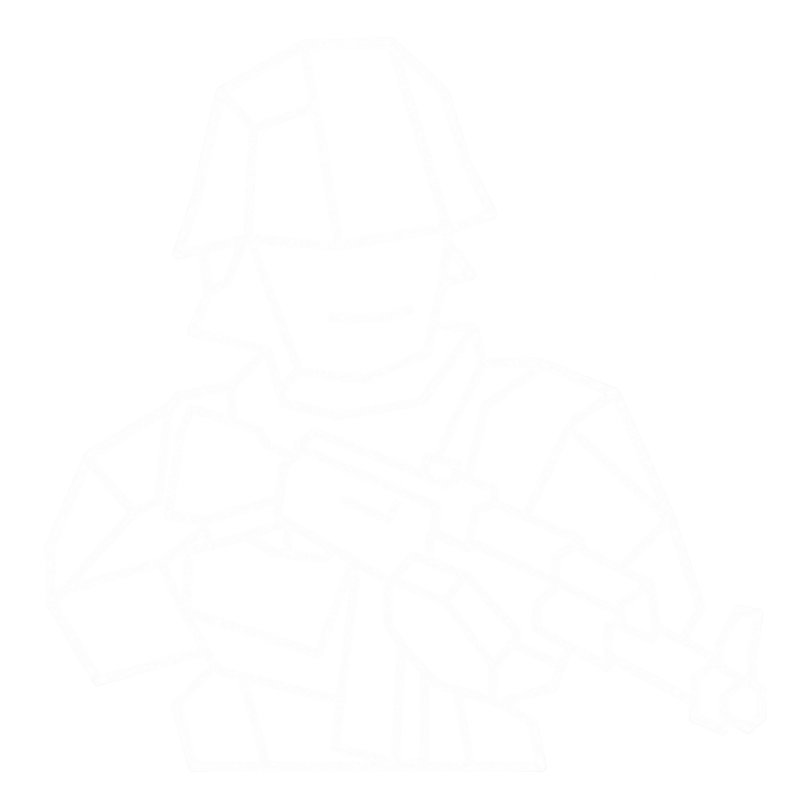

# Hawkstore

[简体中文](README.zh-CN.md) · English

Hawkstore is a Windows desktop manager for Ravenfield BepInEx 5 plugins. It combines a minimal Windhawk-inspired interface with safe local plugin management and lays the groundwork for a GitHub-backed package store.



## Current features

- Detect and install the latest official BepInEx 5 Windows release.
- Detect the Ravenfield executable architecture and select x86/x64 automatically.
- Back up files before a BepInEx upgrade.
- Scan top-level DLLs and plugin folders in `BepInEx/plugins`.
- Enable or disable plugins by moving them between `plugins` and `plugins_disabled`.
- Display read-only author-provided metadata, including SteamID64 and Registry verification state.
- Edit matching BepInEx `.cfg` and `.json` values from each plugin's detail page, including typed numbers, booleans, enumerations, and key bindings.
- Infer BepInEx plugin GUIDs directly from DLL metadata, preserve CFG comments/layout, validate declared types and ranges, and create a backup before every configuration save.
- Search installed plugins.
- Sort by updated time, plugin name, or installed size. Enable/disable never reorders cards until sort or refresh is requested.
- Switch the interface between English (default) and Simplified Chinese.
- Browse the versioned GitHub registry from the in-app Store page.
- Install or reinstall ZIP packages with size and SHA-256 verification.
- Reject unsafe archive paths, back up the existing plugin, and preserve its enabled/disabled state.
- Includes Dynamic Terrain Craters 1.9.0 as the first sample subscription package.
- Compact responsive one-, two-, or three-column card layout.
- Block install and enable/disable operations while Ravenfield is running.

## Build

Requirements: Windows and the .NET 8 SDK.

```powershell
dotnet build .\Hawkstore.csproj -c Release
dotnet publish .\Hawkstore.csproj -c Release -r win-x64 --self-contained false -p:PublishSingleFile=true
```

The default game path is `D:\SteamLibrary\steamapps\common\Ravenfield` and can be changed in the app.

## Repository ecosystem

- `Hawkstore`: desktop client (this repository)
- `hawkstore-registry`: package metadata, schemas, and searchable index
- `hawkstore-publishing`: author packaging and validation tools

See [Architecture](docs/ARCHITECTURE.md) and [Roadmap](docs/ROADMAP.md).

## Security model

BepInEx plugins are executable code. Hawkstore verifies package size and SHA-256, rejects archive path traversal, and backs up an existing installation, but it never claims that third-party plugins are completely safe. New packages should enter the registry through pull requests and automated validation, not direct writes to the default branch.

## Status

The local manager and first GitHub-backed browse/install workflow are working. Version/update detection is the next implementation milestone.
